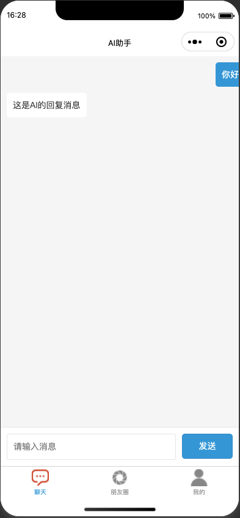
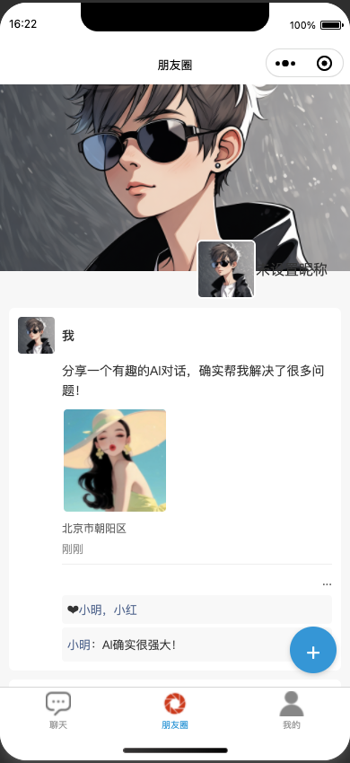
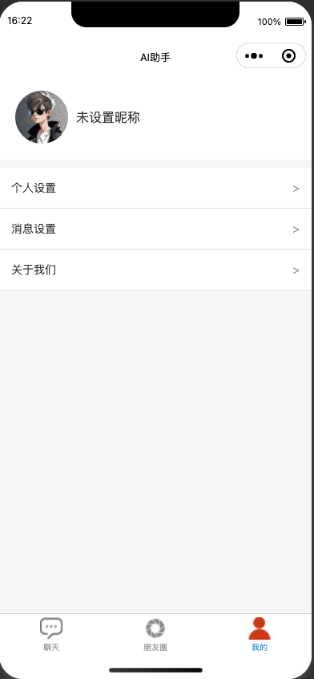
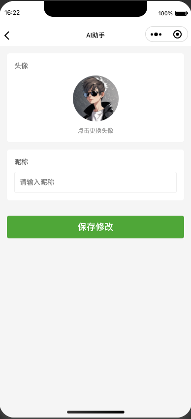
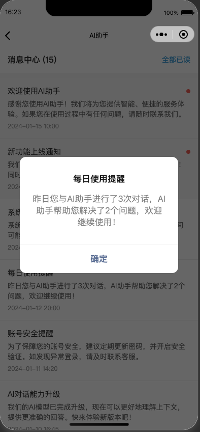
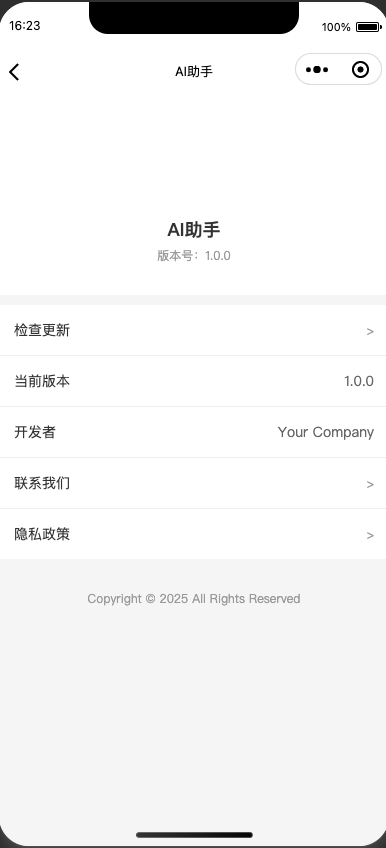

# AI自动编写的微信小程序项目。

## 英文文档
[README_EN.md](README_EN.md)

## 项目简介
这是一个基于微信小程序开发的社交应用，包含朋友圈、个人主页、消息中心等功能模块。

## 功能特性
- 朋友圈：用户可以浏览和发布动态
- 个人主页：展示用户个人信息和相关内容
- 消息中心：处理用户消息通知
- 设置中心：用户可以管理个人设置

## 项目截图 









## 项目结构 

```
├── pages/
│ ├── moments/ # 朋友圈模块
│ ├── profile/ # 个人主页模块
│ ├── message-center/ # 消息中心模块
│ └── settings/ # 设置模块
└── project.config.json # 项目配置文件
```

## 开发环境
- 微信开发者工具
- 基础库最新版本

## 安装和运行
1. 克隆项目到本地
2. 使用微信开发者工具打开项目
3. 在微信开发者工具中导入项目

## 开发指南
1. 确保已安装最新版本的微信开发者工具
2. 在开发之前，请先阅读微信小程序开发文档
3. 遵循项目的代码规范和开发流程

## 部署说明
1. 在微信开发者工具中进行项目测试
2. 确保所有功能正常运行
3. 提交代码审核
4. 发布到微信小程序平台

## 贡献指南
1. Fork 本仓库
2. 创建您的特性分支 (git checkout -b feature/AmazingFeature)
3. 提交您的更改 (git commit -m 'Add some AmazingFeature')
4. 推送到分支 (git push origin feature/AmazingFeature)
5. 创建一个 Pull Request

## 版本历史
- v1.0.0 - 初始版本发布

## 作者
[您的名字/团队名称]

## 许可证
本项目采用 MIT 许可证 - 查看 [LICENSE.md](LICENSE.md) 文件了解详情