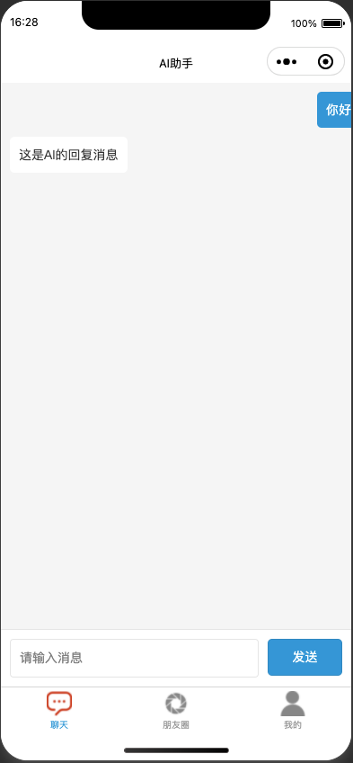
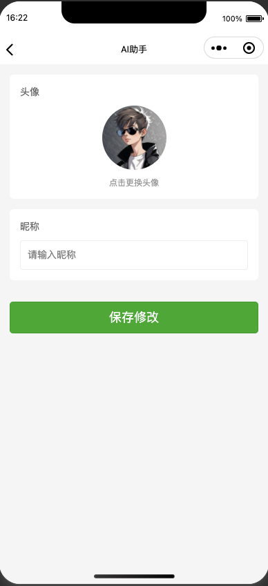

# A WeChat mini program project automatically written by AI.

## Project Overview
This is a social networking application developed based on WeChat Mini Program, including features such as Moments, Personal Profile, Message Center, and more.

## Features
- Moments: Users can browse and post updates
- Profile: Display user's personal information and related content
- Message Center: Handle user message notifications
- Settings: Users can manage personal settings

## Project screenshot 







## Project Structure 

```
├── pages/
│ ├── moments/ # Moments module
│ ├── profile/ # User profile module
│ ├── message-center/ # Message center module
│ └── settings/ # Settings module
└── project.config.json # Project configuration file
```

## Development Environment
- WeChat Developer Tools
- Latest version of WeChat Mini Program base library

## Installation and Running
1. Clone the project locally
2. Open the project with WeChat Developer Tools
3. Import the project in WeChat Developer Tools

## Development Guide
1. Ensure you have installed the latest version of WeChat Developer Tools
2. Read the WeChat Mini Program development documentation before development
3. Follow the project's coding standards and development process

## Deployment Instructions
1. Test the project in WeChat Developer Tools
2. Ensure all features are functioning properly
3. Submit code for review
4. Deploy to WeChat Mini Program platform

## Contributing Guidelines
1. Fork this repository
2. Create your feature branch (git checkout -b feature/AmazingFeature)
3. Commit your changes (git commit -m 'Add some AmazingFeature')
4. Push to the branch (git push origin feature/AmazingFeature)
5. Create a Pull Request

## Version History
- v1.0.0 - Initial Release

## Author
[Your Name/Team Name]

## License
This project is licensed under the MIT License - see the [LICENSE.md](LICENSE.md) file for details